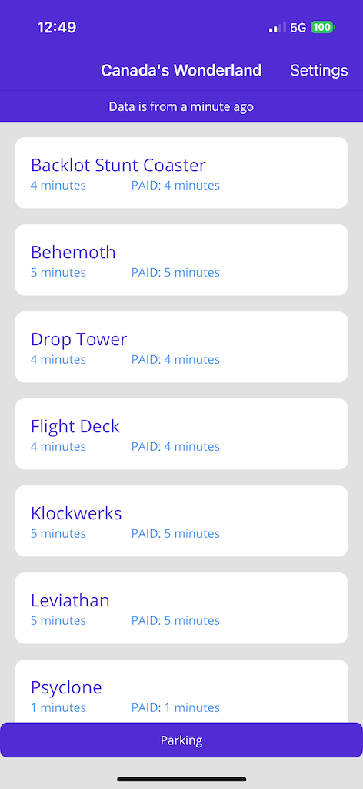
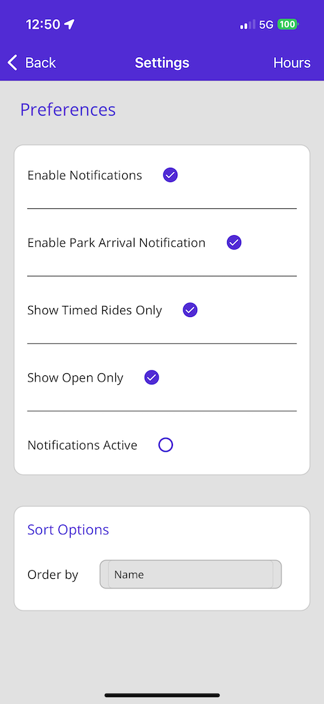
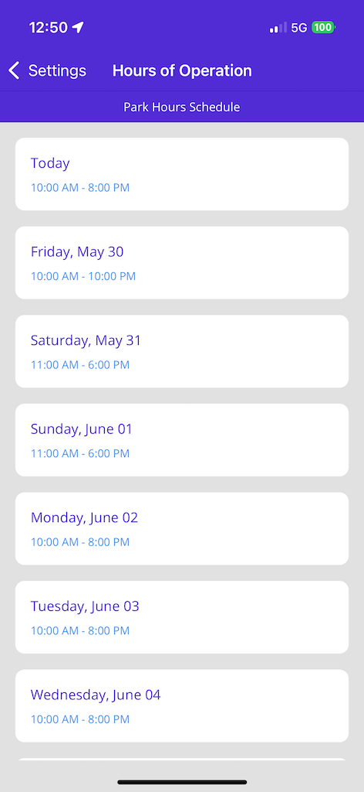
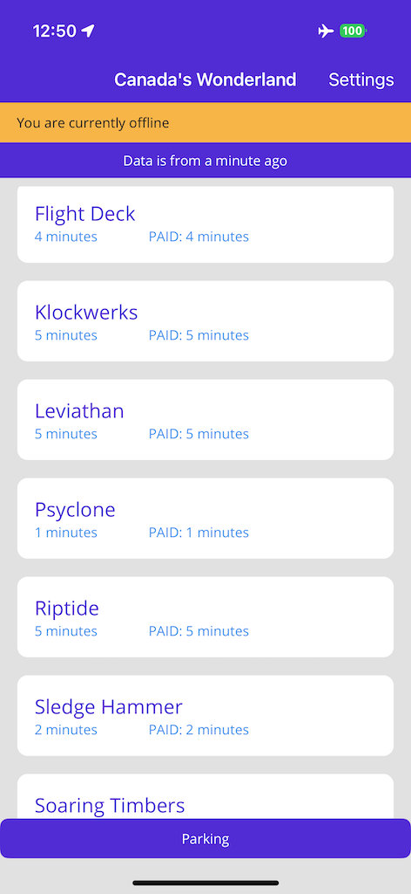

# Canada's Wonderland Ride Times

This app does serve a functional purpose in that it shows available ride times to Canada's Wonderland
This data is pulled from [ThemeParks WIKI](https://themeparks.wiki/)

This app works offline without issue.

## Technology
This app uses several .NET open source technologies from [Shiny](https://github.com/shinyorg)

* [Shiny Mediator](https://github.com/shinyorg/mediator) - [Documentation](https://shinylib.net/mediator/)
  * [Smart HTTP client generation](https://shinylib.net/mediator/extensions/http/)
  * [Persistent app cache](https://shinylib.net/mediator/middleware/caching/#persistent-cache)
  * [Event Broadcasting](https://shinylib.net/mediator/events/) with [MAUI support](https://shinylib.net/mediator/extensions/maui/)
  * [HTTP Calls](https://shinylib.net/mediator/extensions/http)
* [Shiny Mobile Libraries](https://github.com/shinyorg/shiny) - [Documentation](https://shinylib.net)
  * [Periodic Background Jobs](https://shinylib.net/client/jobs/) using Shiny.Jobs
  * [Background GPS](https://shinylib.net/client/locations/gps/) using Shiny.Locations
  * [Geofencing](https://shinylib.net/client/locations/geofencing/) using Shiny.Locations
  * [Local Notifications](https://shinylib.net/client/notifications/) using Shiny.Notifications
  * [Mobile Centric AppSettings.json for Microsoft.Extensions.Configuration](https://shinylib.net/client/other/configuration/) using Shiny.Extensions.Configuration
* [Shiny MAUI Shell Extensions](https://github.com/shinyorg/maui) using Shiny.Maui.Shell - Shell navigation made pleasant

The HTTP API to themeparks wiki is generated using [Shiny Mediators OpenAPI source generator](https://shinylib.net/client/mediator/extensions/http/).  Look in the csproj for the following

```xml
<ItemGroup>
    <MediatorHttp Include="OpenApiRemote"
                  Uri="https://api.themeparks.wiki/docs/v1.yaml"
                  Namespace="ShinyWonderland.ThemeParksApi"
                  ContractPostfix="HttpRequest"
                  Visible="false" />
</ItemGroup>
```

## APP FEATURES
* Decent AI Generated .NET MAUI pure control set with light & dark modes
* Show ride times (including paid times if available) for Canada's Wonderland whether you are inside the park or now
* Ability to filter out closed rides, & rides that don't have an estimated time
* Basic parking locator
* Park Hours of Operation
* Geofence notification reminder for entering to remind user to open app (so GPS is enabled) and to set parking area
* GPS based notifications while in the park notifying you if ride times have been reduced - GPS shuts off once outside of park
* Easy example of a navigation service based on Shell without ViewModel lifecycle [Shiny MAUI Shell](https://github.com/shinyorg/maui)

## KNOWN ISSUES
* New Geofence API for iOS 18 is not yet working in Shiny v4 beta
* Android maps not setup - users need to setup their own keys and stuff
* Theme park API returns data even park is closed
* Distance - Sorting and Display (WIP)

## FEATURE IDEAS
* Peak times - requires server
    * Need weather at current time request
* Wonderland Map
* Restaurant Points with Menu & Prices
  * This data does not come back
  * Could do manual pins?
* Drink & Food Pass Timers
  
## FAQ

> Can I run this for my own local 

Yessir - open themepark.http and run "ALL PARKS" endpoint.  Find your park (if available), copy/paste the entityID and location
into the appsettings.json.  VOILA

> Why broadcast GPS, connectivity, & data refreshes through Mediator

Mediator doesn't need to hook events and then clean them up.  Everything is managed with almost zero code

> Why use mediator for data calls?

Mediator can cache data with nothing more than configuration in appsettings.json.  No layers, no DI hell... just a contract and a single service

> What is the purpose of CoreServices?  This is over complicated dependency injection stuff!

Is it?  Those services are used in pretty much every major class in the app.  This helps alleviate the pain of injecting a TON of services in every constructor


## SCREENSHOTS

It isn't super pretty, but AI built it.  This is about functionality and making shiny code!




