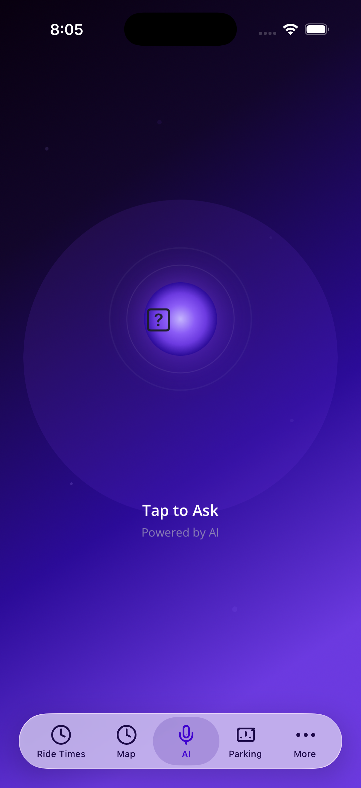

# Shiny Wonderland

A production-quality .NET MAUI reference application for **Canada's Wonderland** that delivers real-time ride wait times, AI-powered park assistance, GPS-based parking, meal-time tracking, and intelligent background notifications — all built on the [Shiny](https://github.com/shinyorg) ecosystem.

Live ride data is sourced from [ThemeParks.wiki](https://themeparks.wiki/).

> [!NOTE]
> This app is under active development and serves as both a functional park companion and a living showcase for best practices across the Shiny .NET libraries.

---

## Features

- **Real-Time Ride Wait Times** — View current standby and paid wait times for every ride, with distance-based sorting when inside the park
- **Interactive Map** — Browse ride locations on a native map with live wait-time pins
- **AI Assistant** — Voice-driven AI assistant powered by Microsoft.Extensions.AI with animated phase feedback (listening, thinking, speaking)
- **Parking Locator** — Save your parking location via GPS, capture a photo of your spot with zoomable image viewer, and clear it when you leave
- **Meal-Time Tracking** — Track food and drink pass usage with countdown timers
- **Park Hours** — View daily hours of operation at a glance
- **Ride History** — Log rides you've been on and review your history across visits
- **Smart Caching** — Cross-session persistent caching keeps the app functional when connectivity drops
- **Background Notifications** — GPS-driven alerts when ride wait times drop, geofence reminders on park entry/exit, and automatic GPS shutdown outside the park to save battery
- **Light & Dark Mode** — Fully themed UI across all screens

---

## Screenshots

| Ride Times | Map | AI Assistant |
|:---:|:---:|:---:|
|  |  |  |

| Parking | Meal Times | Settings |
|:---:|:---:|:---:|
|  |  |  |

---

## Technology Stack

### Libraries

| Library | Description | Links |
|---------|-------------|-------|
| **Shiny.Mediator.Maui** | In-process mediator with middleware pipeline, caching, offline support, and MAUI lifecycle integration | [GitHub](https://github.com/shinyorg/mediator) · [Docs](https://shinylib.net/mediator/) |
| **Shiny.Locations** | Background GPS tracking and geofencing with automatic lifecycle management | [GitHub](https://github.com/shinyorg/shiny) · [Docs](https://shinylib.net/client/locations/gps/) |
| **Shiny.Jobs** | Periodic background jobs that survive app restarts | [GitHub](https://github.com/shinyorg/shiny) · [Docs](https://shinylib.net/client/jobs/) |
| **Shiny.Notifications** | Cross-platform local notifications | [GitHub](https://github.com/shinyorg/shiny) · [Docs](https://shinylib.net/client/notifications/) |
| **Shiny.Extensions.Configuration** | Mobile-friendly `appsettings.json` for `Microsoft.Extensions.Configuration` | [GitHub](https://github.com/shinyorg/shiny) · [Docs](https://shinylib.net/client/other/configuration/) |
| **Shiny.Maui.Shell** | Strongly-typed Shell navigation with ViewModel lifecycle and route source generation | [GitHub](https://github.com/shinyorg/maui) |
| **Shiny.Maui.Controls** | MAUI controls including zoomable `ImageViewer` and floating panels | [GitHub](https://github.com/shinyorg/maui) |
| **Shiny.Extensions.MauiHosting** | Streamlined DI registration and saved-state helpers | [GitHub](https://github.com/shinyorg/extensions) |
| **Shiny.Extensions.Localization.Generator** | Source generator for strongly-typed `IStringLocalizer` access | [GitHub](https://github.com/shinyorg/localizegen) |
| **Shiny.DocumentDb.Sqlite** | Lightweight SQLite-backed document store for local persistence | [GitHub](https://github.com/shinyorg/sqlitedocumentdb) |
| **Shiny.Reflector** | Source-generated reflection metadata for settings and configuration binding | [GitHub](https://github.com/shinyorg/shiny) |
| **Microsoft.Extensions.AI** | Unified AI abstraction layer for model integration | [Docs](https://learn.microsoft.com/en-us/dotnet/ai/ai-extensions) |
| **Microsoft.Extensions.AI.OpenAI** | OpenAI provider for Microsoft.Extensions.AI | [NuGet](https://www.nuget.org/packages/Microsoft.Extensions.AI.OpenAI) |
| **CommunityToolkit.Maui** | Essential MAUI controls, converters, and behaviors | [GitHub](https://github.com/CommunityToolkit/Maui) · [Docs](https://learn.microsoft.com/en-us/dotnet/communitytoolkit/maui/) |
| **CommunityToolkit.Mvvm** | Source-generated MVVM infrastructure (`ObservableProperty`, `RelayCommand`) | [GitHub](https://github.com/CommunityToolkit/dotnet) · [Docs](https://learn.microsoft.com/en-us/dotnet/communitytoolkit/mvvm/) |
| **Sentry.Maui** | Crash reporting and performance monitoring | [GitHub](https://github.com/getsentry/sentry-dotnet) · [Docs](https://docs.sentry.io/platforms/dotnet/guides/maui/) |
| **Microsoft.Maui.Controls.Maps** | Native map controls for iOS, Android, and Mac Catalyst | [Docs](https://learn.microsoft.com/en-us/dotnet/maui/user-interface/controls/map) |

### Dev & Test

| Library | Description | Links |
|---------|-------------|-------|
| **Redth.MauiDevFlow.Agent** | In-app agent for UI automation, visual tree inspection, and CLI-driven testing | [GitHub](https://github.com/AugusteMusic/DevFlowToolkit/tree/main) |
| **TUnit** | Modern .NET test framework with source-generated test discovery | [GitHub](https://github.com/thomhurst/TUnit) |
| **Shouldly** | Human-readable assertion library | [GitHub](https://github.com/shouldly/shouldly) |
| **Imposter** | Lightweight HTTP mocking for integration tests | [NuGet](https://www.nuget.org/packages/Imposter) |

### Key Architectural Patterns

**Source-Generated HTTP Client** — The ThemeParks.wiki API client is generated at compile time from the OpenAPI spec via Shiny Mediator:

```xml
<MediatorHttp Include="OpenApiRemote"
              Uri="https://api.themeparks.wiki/docs/v1.yaml"
              Namespace="ShinyWonderland.ThemeParksApi"
              ContractPostfix="HttpRequest"
              Visible="false" />
```

**Mediator-Driven Architecture** — All data calls, GPS events, connectivity changes, and AI interactions flow through Shiny Mediator. Caching, offline support, and error handling are applied via middleware configuration in `appsettings.json` — no manual wiring required.

**Composable ViewModel Services** — Shared services (navigation, dialogs, mediator, localization) are bundled into `ViewModelServices` to reduce constructor injection noise across ViewModels.

---

## Getting Started

### Run for Your Own Park

1. Open `themepark.http` and run the **ALL PARKS** endpoint
2. Find your park's `entityId` and coordinates
3. Update `appsettings.json` with those values
4. Build and run

### Prerequisites

- .NET 10 SDK
- Xcode 26+ (iOS/Mac Catalyst) or Android SDK 36+ (Android)

---

## UI Testing with MauiDevFlow

This project includes automated UI tests powered by [MauiDevFlow](https://github.com/AugusteMusic/DevFlowToolkit/tree/main).

```bash
# Install the CLI
dotnet tool install --global Redth.MauiDevFlow.CLI

# Boot simulator & deploy
xcrun simctl boot <UDID>
dotnet build src/ShinyWonderland/ShinyWonderland.csproj -f net10.0-ios -t:Run -p:_DeviceName=:v2:udid=<UDID>

# Wait for agent & run tests
maui devflow wait
dotnet test tests/ShinyWonderland.UITests/
```

The test suite covers startup, tab navigation, ride times, map, settings, parking, meal times, hours, and ride history.

---

## Known Issues

- Android maps require manual API key configuration
- ThemeParks API may return data when the park is closed

---

## FAQ

**Can I run this for a different park?**
Yes — find your park via the ThemeParks.wiki API, copy the `entityId` and coordinates into `appsettings.json`, and you're set.

**Why route GPS, connectivity, and data refreshes through Mediator?**
Mediator handles subscription lifecycle automatically — no manual event hookup or cleanup. Everything is managed with near-zero boilerplate.

**Why use Mediator for data calls?**
Mediator enables persistent caching, offline fallback, and middleware pipelines through configuration alone — no service layers or DI complexity.
