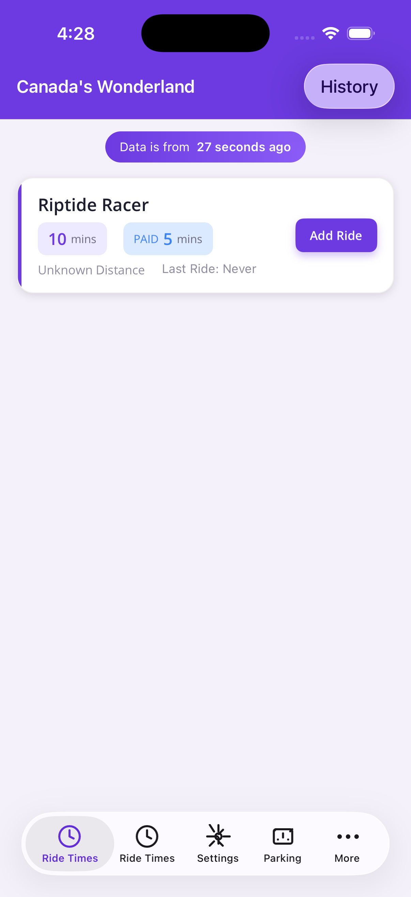
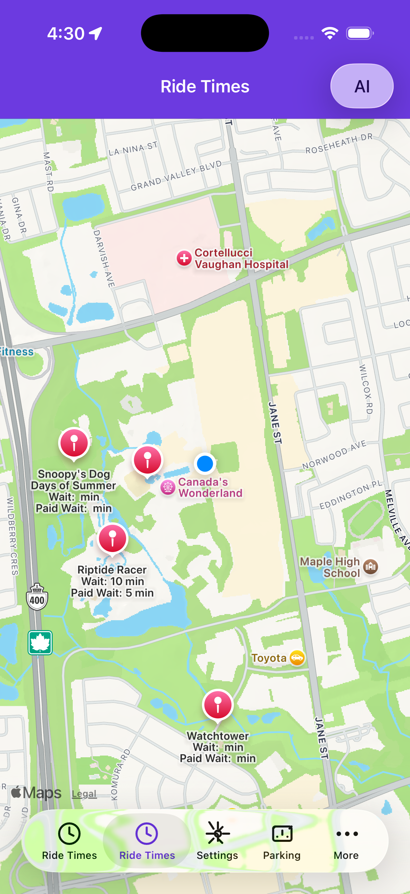
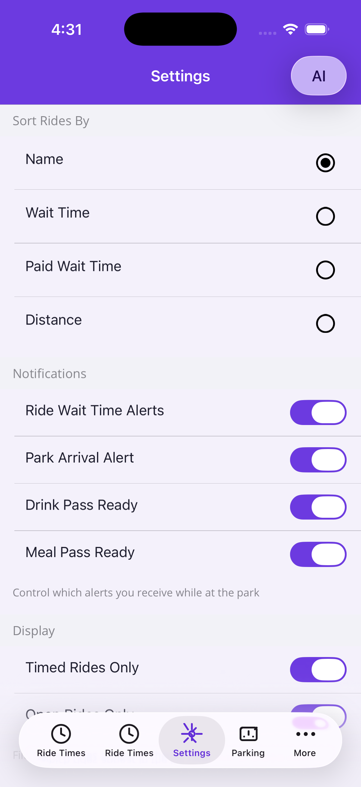
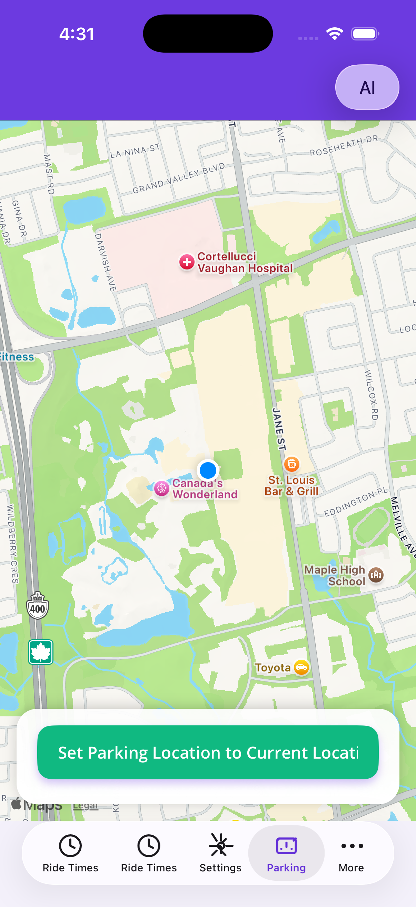
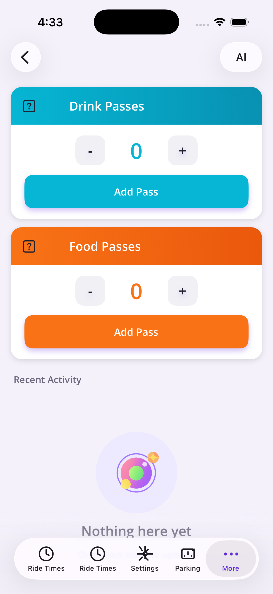

# Canada's Wonderland Ride Times

This app does serve a functional purpose in that it shows available ride times to Canada's Wonderland

The code within this application is used to show best practices using .NET MAUI & many of the Shiny .NET Libraries.

This data is pulled from [ThemeParks WIKI](https://themeparks.wiki/)

> [!NOTE]
> This app is under constant evolution.  I use it as a test ground for many new features I'm creating for my libraries!

## Technology
This app uses several .NET open source technologies from [Shiny](https://github.com/shinyorg)

* [Shiny Mediator](https://github.com/shinyorg/mediator) - [Documentation](https://shinylib.net/mediator/)
  * [Smart HTTP client generation](https://shinylib.net/mediator/extensions/http/)
  * [Persistent app cache](https://shinylib.net/mediator/middleware/caching/#persistent-cache)
  * [Event Broadcasting](https://shinylib.net/mediator/events/) with [MAUI support](https://shinylib.net/mediator/extensions/maui/)
  * [HTTP Calls](https://shinylib.net/mediator/extensions/http)
  * [Offline Data](https://shinylib.net/mediator/middleware/offline/)
* [Shiny Mobile Libraries](https://github.com/shinyorg/shiny) - [Documentation](https://shinylib.net)
  * [Periodic Background Jobs](https://shinylib.net/client/jobs/) using Shiny.Jobs
  * [Background GPS](https://shinylib.net/client/locations/gps/) using Shiny.Locations
  * [Geofencing](https://shinylib.net/client/locations/geofencing/) using Shiny.Locations
  * [Local Notifications](https://shinylib.net/client/notifications/) using Shiny.Notifications
  * [Mobile Centric AppSettings.json for Microsoft.Extensions.Configuration](https://shinylib.net/client/other/configuration/) using Shiny.Extensions.Configuration
* [Shiny MAUI Shell Extensions](https://github.com/shinyorg/maui) using Shiny.Maui.Shell - Shell navigation made pleasant
* [Shiny Extensions](https://github.com/shinyorg/extensions) - Tools for making dependency injection and save state easy
* [Shiny SqliteDocumentDb](https://github.com/shinyorg/sqlitedocumentdb) - Lightweight SQLite-backed document store for local persistence
* [Strongly Typed Localization for IStringLocalizer](https://github.com/shinyorg/localizegen)

The HTTP API to themeparks wiki is generated using [Shiny Mediators OpenAPI source generator](https://shinylib.net/client/mediator/extensions/http/).  Look in the csproj for the following

```xml
<ItemGroup>
    <MediatorHttp Include="OpenApiRemote"
                  Uri="https://api.themeparks.wiki/docs/v1.yaml"
                  Namespace="ShinyWonderland.ThemeParksApi"
                  ContractPostfix="HttpRequest"
                  Visible="false" />
</ItemGroup>
```

## APP FEATURES
* Decent AI Generated .NET MAUI pure control set with light & dark modes
* Show ride times (including paid times if available) for Canada's Wonderland whether you are inside the park or now
* Ability to filter out closed rides, & rides that don't have an estimated time
* Smart & Cross Session Persistent Cache for those time your phone goes offline
* Basic parking locator
* Park Hours of Operation
* Geofence notification reminder for entering to remind user to open app (so GPS is enabled) and to set parking area
* GPS based notifications while in the park notifying you if ride times have been reduced - GPS shuts off once outside of park
* Easy example of a navigation service based on Shell without ViewModel lifecycle [Shiny MAUI Shell](https://github.com/shinyorg/maui)
* Track Ride History
* Distance - Sorting and Display

## WIP
* Meal Time (Notify on timer passed?) - use Notification Timer (what about distance)
  * Link in tabs IF enabled?
  * Separate drink & food passes
  * Maybe turn this option on in settings instead

## KNOWN ISSUES
* Android maps not setup - users need to setup their own keys and stuff
* Theme park API returns data even park is closed

## FEATURE IDEAS
* Peak times - requires server
    * Need weather at current time request
* Wonderland Map
* Restaurant Points with Menu & Prices
  * This data does not come back
  * Could do manual pins?
  
## FAQ

> Can I run this for my own local 

Yessir - open themepark.http and run "ALL PARKS" endpoint.  Find your park (if available), copy/paste the entityID and location
into the appsettings.json.  VOILA

> Why broadcast GPS, connectivity, & data refreshes through Mediator

Mediator doesn't need to hook events and then clean them up.  Everything is managed with almost zero code

> Why use mediator for data calls?

Mediator can cache data with nothing more than configuration in appsettings.json.  No layers, no DI hell... just a contract and a single service

> What is the purpose of CoreServices?  This is over complicated dependency injection stuff!

Is it?  Those services are used in pretty much every major class in the app.  This helps alleviate the pain of injecting a TON of services in every constructor


## UI AUTOMATED TESTING WITH MAUIDEVFLOW

This project includes UI automated tests powered by [MauiDevFlow](https://github.com/Redth/MauiDevFlow), which provides an in-app agent that exposes a CLI for inspecting and interacting with the running app.

### Setup

1. **Install the CLI tool:**
```bash
dotnet tool install --global Redth.MauiDevFlow.CLI
```

2. **The NuGet package is already integrated** - `Redth.MauiDevFlow.Agent` is added to the main app project (Debug only) and registered in `MauiProgram.cs`:
```csharp
#if DEBUG
builder.AddMauiDevFlowAgent();
#endif
```

3. **AutomationId attributes** are set on all key UI elements across every page for stable element targeting.

### Running UI Tests

1. Boot a simulator/emulator:
```bash
xcrun simctl boot <UDID>  # iOS
```

2. Build & deploy the app (keep this running):
```bash
dotnet build src/ShinyWonderland/ShinyWonderland.csproj -f net10.0-ios -t:Run -p:_DeviceName=:v2:udid=<UDID>
```

3. Wait for the agent to connect:
```bash
maui-devflow wait
```

4. Run the UI tests:
```bash
dotnet test tests/ShinyWonderland.UITests/
```

### Test Coverage

The UI test suite (`tests/ShinyWonderland.UITests/`) covers:
- **Startup** - App loads and navigates from splash to main tab bar
- **Navigation** - All 6 tabs are reachable via Shell navigation
- **Ride Times** - Page elements load (timestamp, collection view, refresh, history button)
- **Map Ride Times** - Map control renders
- **Settings** - Sort radio buttons, notification switches, display filters, version label
- **Parking** - Map and toggle parking button
- **Meal Times** - Drink/food pass buttons and collection view
- **Hours** - Schedule collection view
- **Ride History** - Navigated via toolbar button, collection view loads

### Generating Tests with AI

These tests were generated by having Claude Code:
1. Analyze all XAML pages and ViewModels to understand every screen's UI elements
2. Add `AutomationId` attributes to all interactive controls
3. Create a `MauiDevFlowDriver` helper that wraps `maui-devflow` CLI commands
4. Write xUnit tests that use the driver to navigate, tap, assert, and screenshot each screen

## SCREENSHOTS

It isn't super pretty, but AI built it.  This is about functionality and making shiny code!

| Ride Times | Map Ride Times | Settings |
|:---:|:---:|:---:|
|  |  |  |

| Parking | Meal Times |
|:---:|:---:|
|  |  |