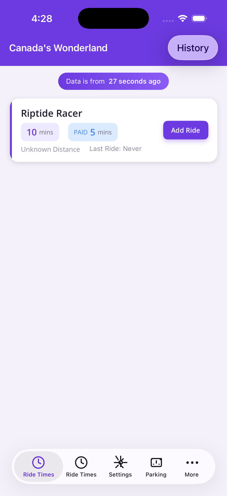
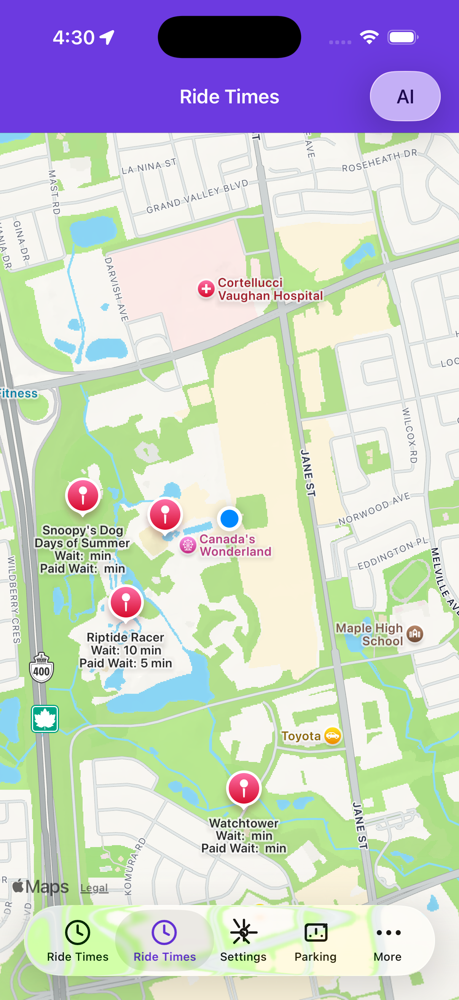
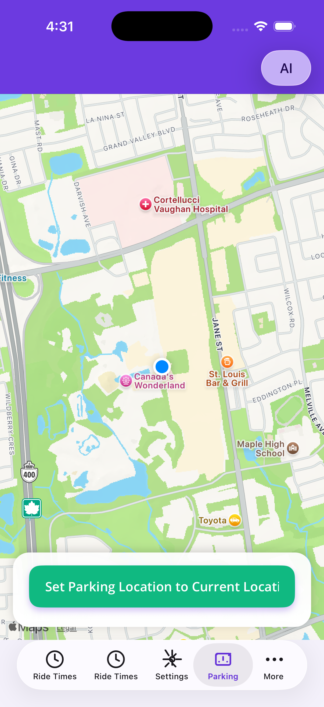
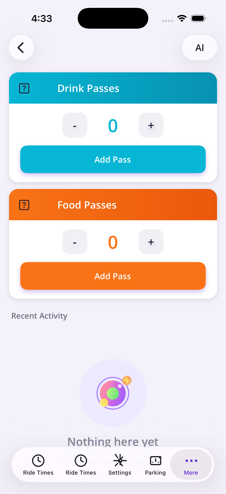
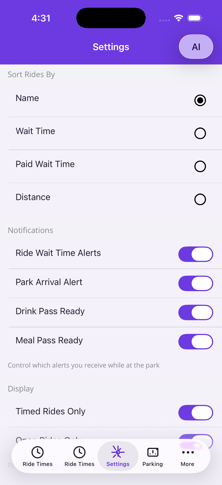

# Shiny Wonderland

A production-quality .NET MAUI reference application for **Canada's Wonderland** that delivers real-time ride wait times, Siri and Gemini integration, GPS-based parking, meal-time tracking, and intelligent background notifications — all built on the [Shiny](https://github.com/shinyorg) ecosystem.

Live ride data is sourced from [ThemeParks.wiki](https://themeparks.wiki/).

> [!NOTE]
> This app is under active development and serves as both a functional park companion and a living showcase for best practices across the Shiny .NET libraries.

---

## Features

- **Real-Time Ride Wait Times** — Current standby and paid wait times for every ride, sortable by name, wait time, paid wait time, or distance (when you're inside the park), with filters for open-only and timed-only rides
- **Interactive Map** — Ride locations on a native map with live wait-time pins
- **Siri, Shortcuts & Gemini** — The app's key actions are exposed to the system assistants through [Shiny.AppFunctions](#siri-shortcuts--gemini) — ask for wait times, park hours, the weather, or directions without opening the app
- **Parking Locator** — Save your parking spot via GPS (only inside the park), attach a photo of your spot with a zoomable image viewer, and get walking directions back to your car. The screen stays in sync when parking is saved by voice or cleared automatically when you leave
- **Meal-Time Tracking** — Track food and drink pass usage with countdown timers until your next pass is ready
- **Park Hours** — Daily hours of operation, including the next open day when the park is closed
- **Ride History** — Log rides you've been on and review your history across visits
- **Smart Caching** — Cross-session persistent caching keeps the app functional when connectivity drops
- **Background Notifications** — Alerts when ride wait times drop, a park-arrival reminder via geofence, meal and drink pass reminders, and automatic GPS shutdown outside the park to save battery. Each alert can be switched off in Settings
- **Light & Dark Mode** — Fully themed UI across all screens

### Siri, Shortcuts & Gemini

Each action is declared once in C# with Shiny.AppFunctions and handled through Shiny Mediator. The source generator emits the App Intents on iOS (Siri, Spotlight, Shortcuts, Apple Intelligence) and the AppFunctions schema on Android 16+ (Gemini and other agents).

| Function | What it does | Siri phrase |
|----------|--------------|-------------|
| `get_ride_wait_times` | All open rides sorted by shortest wait, or the wait for one ride | "What are the wait times at Wonderland" · "What has the shortest line at Wonderland" |
| `directions_to_ride` | Opens walking directions to a ride | "Take me to a ride in Wonderland" |
| `get_last_ride_time` | When you last rode a specific ride | "When did I last ride at Wonderland" |
| `get_park_hours` | Hours for today or a given date, or the next open day | "When is Wonderland open" |
| `get_weather` | Current conditions or a forecast for a date at the park ([Open-Meteo](https://open-meteo.com/)) | "What's the weather at Wonderland" |
| `set_my_parking` | Saves your current location as your parking spot (must be at the park) | "Remember where I parked at Wonderland" |
| `map_to_car` | Opens walking directions to your saved parking spot | "Where did I park at Wonderland" |

Rides are an `[AppEntity]`, so Siri and Shortcuts show a ride picker, and Android agents get a generated `search_ride` function instead of having to know ride IDs.

---

## Screenshots

| Ride Times | Map |
|:---:|:---:|
|  |  |

| Parking | Meal Times | Settings |
|:---:|:---:|:---:|
|  |  |  |

---

## Technology Stack

### Libraries

| Library | Description | Links |
|---------|-------------|-------|
| **Shiny.AppFunctions** | Declare app actions once in C# and expose them to Siri/Shortcuts (App Intents) and Gemini (Android AppFunctions) | [GitHub](https://github.com/shinyorg/shiny) · [Docs](https://shinylib.net/client/) |
| **Shiny.Mediator.AppFunctions** | Runs App Function calls through Shiny Mediator handlers | [GitHub](https://github.com/shinyorg/mediator) · [Docs](https://shinylib.net/mediator/) |
| **Shiny.Mediator.Maui** | In-process mediator with middleware pipeline, caching, offline support, and MAUI lifecycle integration | [GitHub](https://github.com/shinyorg/mediator) · [Docs](https://shinylib.net/mediator/) |
| **Shiny.Locations** | Background GPS tracking and geofencing with automatic lifecycle management | [GitHub](https://github.com/shinyorg/shiny) · [Docs](https://shinylib.net/client/locations/gps/) |
| **Shiny.Jobs** | Periodic background jobs that survive app restarts | [GitHub](https://github.com/shinyorg/shiny) · [Docs](https://shinylib.net/client/jobs/) |
| **Shiny.Notifications** | Cross-platform local notifications | [GitHub](https://github.com/shinyorg/shiny) · [Docs](https://shinylib.net/client/notifications/) |
| **Shiny.Extensions.Configuration** | Mobile-friendly `appsettings.json` for `Microsoft.Extensions.Configuration` | [GitHub](https://github.com/shinyorg/shiny) · [Docs](https://shinylib.net/client/other/configuration/) |
| **Shiny.Maui.Shell** | Strongly-typed Shell navigation with ViewModel lifecycle and route source generation | [GitHub](https://github.com/shinyorg/maui) |
| **Shiny.Maui.Controls** | MAUI controls including zoomable `ImageViewer` and floating panels | [GitHub](https://github.com/shinyorg/maui) |
| **Shiny.Extensions.MauiHosting** | Streamlined DI registration and saved-state helpers | [GitHub](https://github.com/shinyorg/extensions) |
| **Shiny.Extensions.Localization.Generator** | Source generator for strongly-typed `IStringLocalizer` access | [GitHub](https://github.com/shinyorg/localizegen) |
| **Shiny.DocumentDb.Sqlite** | Lightweight SQLite-backed document store for local persistence | [GitHub](https://github.com/shinyorg/sqlitedocumentdb) |
| **CommunityToolkit.Mvvm** | Source-generated MVVM infrastructure (`ObservableProperty`, `RelayCommand`) | [GitHub](https://github.com/CommunityToolkit/dotnet) · [Docs](https://learn.microsoft.com/en-us/dotnet/communitytoolkit/mvvm/) |
| **Sentry.Maui** | Crash reporting and performance monitoring | [GitHub](https://github.com/getsentry/sentry-dotnet) · [Docs](https://docs.sentry.io/platforms/dotnet/guides/maui/) |
| **Microsoft.Maui.Controls.Maps** | Native map controls for iOS, Android, and Mac Catalyst | [Docs](https://learn.microsoft.com/en-us/dotnet/maui/user-interface/controls/map) |

### Dev & Test

| Library | Description | Links |
|---------|-------------|-------|
| **Redth.MauiDevFlow.Agent** | In-app agent for UI automation, visual tree inspection, and CLI-driven testing | [GitHub](https://github.com/AugusteMusic/DevFlowToolkit/tree/main) |
| **TUnit** | Modern .NET test framework with source-generated test discovery | [GitHub](https://github.com/thomhurst/TUnit) |
| **Shouldly** | Human-readable assertion library | [GitHub](https://github.com/shouldly/shouldly) |
| **Imposter** | Lightweight HTTP mocking for integration tests | [NuGet](https://www.nuget.org/packages/Imposter) |

### Key Architectural Patterns

**Source-Generated HTTP Client** — The ThemeParks.wiki API client is generated at compile time from the OpenAPI spec via Shiny Mediator:

```xml
<MediatorHttp Include="OpenApiRemote"
              Uri="https://api.themeparks.wiki/docs/v1.yaml"
              Namespace="ShinyWonderland.ThemeParksApi"
              ContractPostfix="HttpRequest"
              Visible="false" />
```

**Mediator-Driven Architecture** — All data calls, GPS events, connectivity changes, and Siri/Gemini App Function calls flow through Shiny Mediator. Caching, offline support, and error handling are applied via middleware configuration in `appsettings.json` — no manual wiring required.

**Composable ViewModel Services** — Shared services (navigation, dialogs, mediator, localization) are bundled into `ViewModelServices` to reduce constructor injection noise across ViewModels.

---

## Getting Started

### Run for Your Own Park

1. Open `themepark.http` and run the **ALL PARKS** endpoint
2. Find your park's `entityId` and coordinates
3. Update `appsettings.json` with those values
4. Build and run

### Prerequisites

- .NET 10 SDK
- Xcode 26+ (iOS/Mac Catalyst) or Android SDK 36+ (Android)

---

## UI Testing with MauiDevFlow

This project includes automated UI tests powered by [MauiDevFlow](https://github.com/AugusteMusic/DevFlowToolkit/tree/main).

```bash
# Install the CLI
dotnet tool install --global Redth.MauiDevFlow.CLI

# Boot simulator & deploy
xcrun simctl boot <UDID>
dotnet build src/ShinyWonderland/ShinyWonderland.csproj -f net10.0-ios -t:Run -p:_DeviceName=:v2:udid=<UDID>

# Wait for agent & run tests
maui devflow wait
dotnet test tests/ShinyWonderland.UITests/
```

The test suite covers startup, tab navigation, ride times, map, settings, parking, meal times, hours, and ride history.

---

## Known Issues

- Android maps require manual API key configuration
- ThemeParks API may return data when the park is closed

---

## FAQ

**Can I run this for a different park?**
Yes — find your park via the ThemeParks.wiki API, copy the `entityId` and coordinates into `appsettings.json`, and you're set.

**Why route GPS, connectivity, and data refreshes through Mediator?**
Mediator handles subscription lifecycle automatically — no manual event hookup or cleanup. Everything is managed with near-zero boilerplate.

**Why use Mediator for data calls?**
Mediator enables persistent caching, offline fallback, and middleware pipelines through configuration alone — no service layers or DI complexity.
